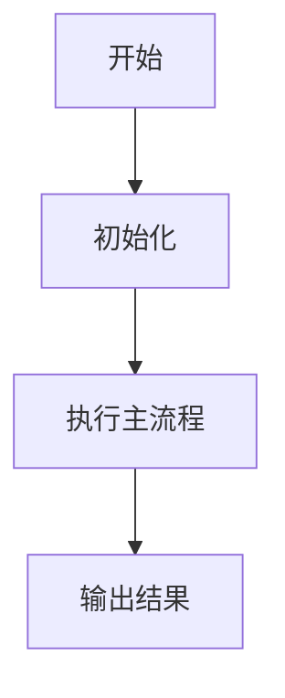

# DESIGN 模板

## 1. 文档目标

这份文档面向维护者，详细说明内部实现方案。

## 2. 设计目标

- 要解决的问题：
- 为什么采用当前方案：
- 本方案的主要收益：

## 3. 分层结构

- 对外层：
- 对内层：
- 宿主协作点：

## 4. 核心流程

建议补充：

- 正常流程
- 状态变化流程
- 异常流程

如果适合，补流程图：

## 5. 关键类职责

| 类 / 对象 | 职责 | 说明 |
|------|------|------|
|  |  |  |

## 6. 状态与调度逻辑

- 关键状态有哪些：
- 状态如何流转：
- 谁负责调度：
- 谁负责数据组装：

## 7. 策略与规则

- 默认策略：
- 可配置策略：
- 降级策略：

## 8. 风险与边界

- 已知风险：
- 已知限制：
- 暂不处理的问题：

## 9. 调试能力

- 是否存在调试 UI / 日志 / 面板：
- 如何开启：
- 如何与正式能力隔离：

## 10. 为什么这样设计

- 为什么不直接暴露内部实现：
- 为什么当前入口和配置这样收口：
- 后续如果迁移正式项目，应优先保留什么：

## 11. 可选：性能 / 实验调研结论

如果当前模块做过性能实验、GPU/Profile 对比、渲染链路验证、缓存命中验证等调研，
建议额外补一节，把“现象、排除项、结论、后续建议”写清楚，避免后续重复试验。

推荐结构：

- 调研背景：
  例如页面为什么要做性能分析，当前体感问题或观测指标是什么。
- 已确认的现象：
  只写重复验证过的事实，不提前下结论。
- 已排除或基本排除的因素：
  记录试过哪些变量、为什么可以先排除。
- 当前判断：
  基于现象和实验结果，给出当前最稳妥的解释。
- 对业务的影响：
  区分“Profile 现象”和“真实用户可感知卡顿”。
- 后续建议：
  说明是否继续优化、回退实验代码、还是先转入真实体验验证。

可直接参考下面的写法：

- 调研背景：
  当前页面在 GPU / Profile 指标上表现异常，需要判断是单一控件问题、刷新时机问题，还是页面渲染路径差异。
- 已确认的现象：
  某些实验变量变化后指标显著改善，某些变量变化后几乎没有改善。
- 已排除或基本排除的因素：
  例如去掉调试卡片、降低文本刷新频率、调整控件粒度后，问题仍然存在。
- 当前判断：
  当前问题更可能与页面整体渲染路径或控件类型相关，而不是单个参数配置问题。
- 对业务的影响：
  当前指标异常不一定等价于真实体感卡顿，需要结合掉帧、点击响应、滑动流畅度继续判断。
- 后续建议：
  当前这轮实验已经足够收口，优先记录结论；如果继续优化，应改为围绕真实用户体验做验证。
